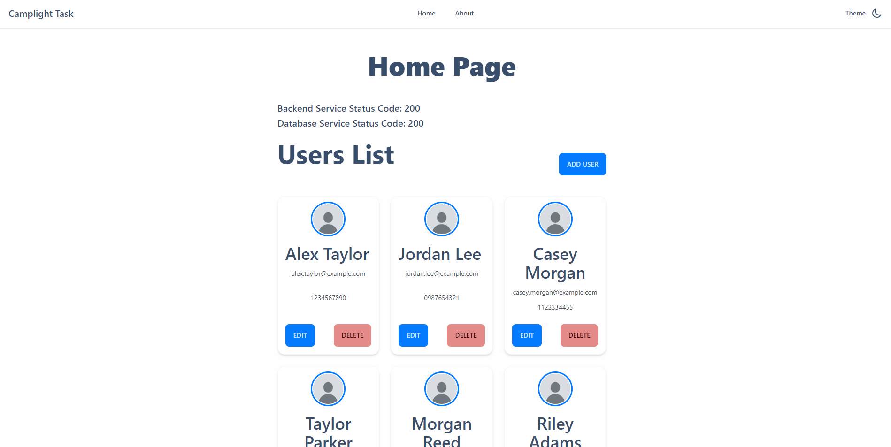

<a name="readme-top"></a>

<!-- PROJECT LOGO -->
<br />
<div align="center">
  <a href="https://github.com/PeterYordanov/camplight-task">
    
  </a>

  <h3 align="center">Camplight task</h3>

  <p align="center">
    Project to manage users with a UI, Backend and Database, all deployable through docker compose.
  </p>
</div>


<!-- TABLE OF CONTENTS -->
<details>
  <summary>Table of Contents</summary>
  <ol>
    <li>
      <a href="#about-the-project">About The Project</a>
      <ul>
        <li><a href="#built-with">Built With</a></li>
      </ul>
    </li>
    <li>
      <a href="#getting-started">Getting Started</a>
      <ul>
        <li><a href="#prerequisites">Prerequisites</a></li>
        <li><a href="#installation">Installation</a></li>
      </ul>
    </li>
    <li><a href="#roadmap">Roadmap</a></li>
    <li><a href="#contact">Contact</a></li>
    <li><a href="#acknowledgments">Acknowledgments</a></li>
  </ol>
</details>


<!-- ABOUT THE PROJECT -->
## About The Project

[![Product Name Screen Shot][product-screenshot]](https://example.com)

The process described below outlines the methodology for how this project/task was built, what technologies and how to set it up locally.

### Built With

This section lists any major frameworks/libraries used to bootstrap the project.

* [![React][React]][React-url] -> [![JS][JS]][JS-url]
* [![FastAPI][FastAPI]][FastAPI-url] -> [![Python][Python]][Python-url]
* [![PostgreSQL][PostgreSQL]][PostgreSQL-url]
* [![Docker][Docker]][Docker-url]

<p align="right">(<a href="#readme-top">back to top</a>)</p>


<!-- GETTING STARTED -->
## Getting Started

Instructions on how to get started

### Prerequisites

Docker with Docker Compose must be installed

### Installation

   ```sh
   git clone https://github.com/PeterYordanov/camplight-task.git
   ```

   ```sh
   cd camplight-task
   ```

   ```sh
   docker-compose up --build
   ```


<p align="right">(<a href="#readme-top">back to top</a>)</p>


<!-- ROADMAP -->
## Roadmap

- [x] React frontend
  - [x] Users service
  - [x] Health service
  - [x] Input Validation
- [x] Backend
  - [x] Users (CRUD)
    - [x] Create
      - [x] Upon creation, add an AI-genereated image (Cheated a bit here with thispersondoesnotexist.com)
    - [x] Read
    - [x] Update
    - [x] Delete
  - [x] Health Service
    - [x] Ping
    - [x] Test DB
  - [x] DB Setup
    - [x] Tables set up on startup
    - [x] Seed data
- [x] Deployment (Local)
  - [x] Docker compose
  - [x] Frontend
  - [x] Deployment
  - [x] PostgreSQL Database
- [x] Security
  - [x] Input validation with Pydantic on the backend
  - [x] CORS
- [ ] Unit Tests
- [ ] Swagger


<p align="right">(<a href="#readme-top">back to top</a>)</p>

<!-- AUTHORS -->
## Authors

Petar Yordanov - <peter.yordanov0@gmail.com>

<p align="right">(<a href="#readme-top">back to top</a>)</p>


<!-- MARKDOWN LINKS & IMAGES -->
<!-- https://www.markdownguide.org/basic-syntax/#reference-style-links -->
[product-screenshot]: images/Animation.gif
[Python]: https://img.shields.io/badge/python-000000?style=for-the-badge&logo=python&logoColor=white
[Python-url]: https://www.python.org/
[FastAPI]: https://img.shields.io/badge/fastapi-000000?style=for-the-badge&logo=fastapi&logoColor=white
[FastAPI-url]: https://fastapi.tiangolo.com/
[JS]: https://img.shields.io/badge/javascript-000000?style=for-the-badge&logo=javascript&logoColor=white
[JS-url]: https://developer.mozilla.org/en-US/docs/Web/JavaScript
[React]: https://img.shields.io/badge/react-000000?style=for-the-badge&logo=react&logoColor=white
[React-url]: https://react.dev/
[PostgreSQL]: https://img.shields.io/badge/postgresql-000000?style=for-the-badge&logo=postgresql&logoColor=white
[PostgreSQL-url]: https://www.postgresql.org/
[Docker]: https://img.shields.io/badge/docker-000000?style=for-the-badge&logo=docker&logoColor=white
[Docker-url]: https://www.docker.com/